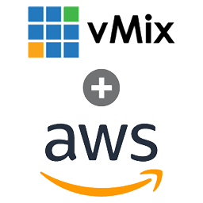
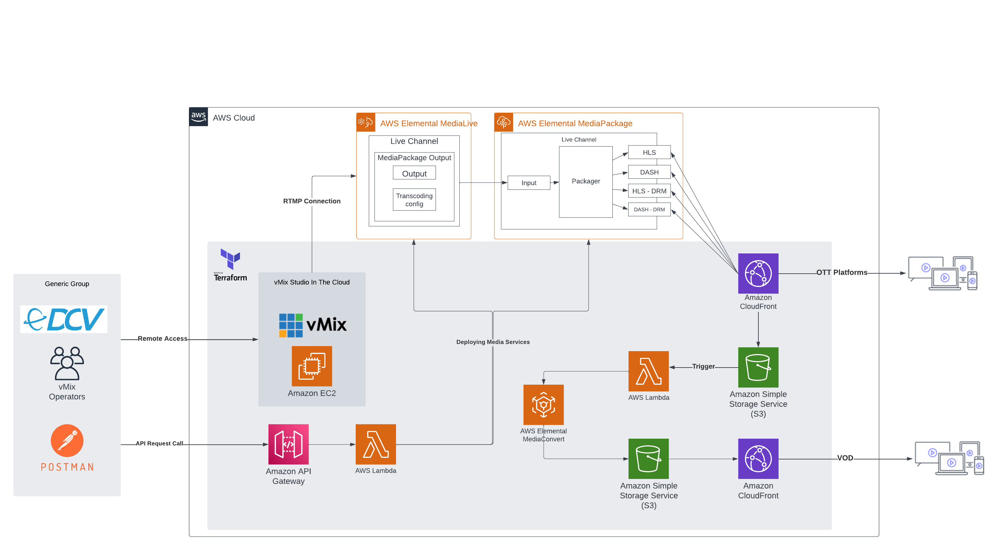

<div align="center">
    
</div>

<h3 align="center">vMix on AWS</h3>

<p align="center">
Running vMix software on the cloud
</p>

<details>
  <summary>Table of Contents</summary>
  <ol>
    <li>
      <a href="#getting-started">Getting started</a>
      <ul>
        <li><a href="#prerequisites">Prerequisites</a></li>
        <li><a href="#setup">Setup</a></li>
        <li><a href="#deploy">Deploy</a></li>
        <li><a href="#advanced-setup-aws-live-streaming">Advanced Setup</a></li>
      </ul>
    </li>
    <li>
      <a href="#references">References</a>
    </li>
  </ol>
</details>
<br/>

# Getting started

The following steps describe how to deploy a vMix environment using terraform.  
Read more about vMix here: https://www.vmix.com/software/  
It will deploy the following resources and applications (default):

### Network

> 1 VPC <br/>
> 2 Public Subnets* <br/>
> 2 Private Subnets* <br/>
> 2 NAT Gateway* <br/>
> 2 Elastic IPs* <br/>
> 1 Security Group <br/>

### IAM

> Roles  
> Policies

### EC2

> 1 Private Key <br/>
> 1 AWS Key Pair <br/>
> 1 EC2 **g4dn.2xlarge** instance with:
>> Nice DCV  
> > NVIDIA GRID Driver  
> > NDI  
> > vMix
> > Sample Audio/Video files

### Elemental Resources

> Media Live <br/>
> Media Package <br/>
> Media Convert

### Serverless Resources

> API Gateway <br/>
> Lambda Functions <br/>

### Other

> S3 Bucket <br/>
> DynamoDB  

### Optional

> Cloudfront <br/>

*Those resource will depend on how many subnets you want to your infrastructure.  
The guide assumes 2 subnets are enough. Though you can change it setting the ``private_subnets`` and ``public_subnets`` var values.

# Prerequisites

The following tools need to be installed on your system prior to deploy VMix:

- AWS Access and Secret Key with permission to create IAM roles(Administrative User);
    - Instructions to create the keys:  
      https://docs.aws.amazon.com/IAM/latest/UserGuide/id_credentials_access-keys.html#Using_CreateAccessKey
- AWS CLI;
    - Installation instructions:  
      https://docs.aws.amazon.com/cli/latest/userguide/getting-started-install.html
- jq (json processor):
    - Installer: 
      https://stedolan.github.io/jq/download/
- Git;
    - Installation instructions:  
      https://git-scm.com/book/en/v2/Getting-Started-Installing-Git
- Terraform;
    - Installation instructions:
      https://developer.hashicorp.com/terraform/tutorials/aws-get-started/install-cli
- Nice DCV Client;
    - Installer:  
      https://download.nice-dcv.com/

- zip
    - How to install on many linux distro:  
    https://www.tecmint.com/install-zip-and-unzip-in-linux/

  If you don't have an Administrative user yet, besides the root user, just walkthrough this guide:  
  https://docs.aws.amazon.com/singlesignon/latest/userguide/getting-started.html

# Architecture Diagram



# Setup

To start, clone this repository using git.  
Then, follow the steps always on the repository root folder.  
If you need help to clone the repository follow this guide:  
https://docs.github.com/en/repositories/creating-and-managing-repositories/cloning-a-repository

1. Let's create the IAM role that will be used to create the resources.  
   Firstly, get the AWS account ID running the command bellow, and note it somewhere:
    ```bash
    aws sts get-caller-identity | jq -r '.Account'
    ```  

   Create a file ``trust-policy.json`` with the following content replacing ``YOUR-AWS-ACCOUNT-ID`` with the ID informed
   by the command executed previously:
    ```json
    {
        "Version": "2012-10-17",
        "Statement": [
            {
                "Sid": "Statement1",
                "Effect": "Allow",
                "Principal": {
                    "AWS": "arn:aws:iam::{YOUR-AWS-ACCOUNT-ID}:root"
                },
                "Action": "sts:AssumeRole"
            }
        ]
    }
    ```

   Now, you need to run these commands. Remember to replace ``{YOUR-AWS-ACCOUNT-ID}``:
    ```bash
    aws iam create-role --role-name deploy-vmix-role --assume-role-policy-document file://trust-policy.json && \
        aws iam create-policy --policy-name EC2VmixAccess --policy-document file://policies.json && \
        aws iam attach-role-policy --policy-arn arn:aws:iam::{YOUR-AWS-ACCOUNT-ID}:policy/EC2VmixAccess --role-name deploy-vmix-role
    ```

2. Now it's time to configure a profile for AWS CLI using the role.  
   Add to the file ``~/.aws/credentials`` the new role just created as a new profile.  
   Here the ``{YOUR-AWS-ACCOUNT-ID}`` replacement is also necessary, and replace the ``{AWS-REGION}`` to the one desired to
   deploy the resources:
    ```bash
    echo "[vmix]
    role_arn = arn:aws:iam::{YOUR-AWS-ACCOUNT-ID}:role/deploy-vmix-role
    source_profile = default
    region = {AWS-REGION}" >> ~/.aws/credentials
    ```

   If your access and secret keys are on another profile than the ``default profile`` change the ``source_profile``
   value above accordingly to the profile with the keys.  
   For more information about using roles with aws cli read it
   here:  https://docs.aws.amazon.com/cli/latest/userguide/cli-configure-role.html

# Deploy

The infrastructure has some variables with default values (such as aws region and instance type) that can be changed
through a .tfvars file.

1. copy the
   `terraform.tfvars.example` file and add it to a `terraform.tfvars` file in the root of the `terraform` folder.
2. You need to input the values for the variables ``cidr``, ``azs``, ``private_subnets``, ``public_subnets``, and ``aws_region``.  
If not ``terraform apply`` will fail.  
Example:
    ```yaml
    cidr = "10.20.0.0/16"

    azs = ["us-west-2a", "us-west-2c"]

    private_subnets = ["10.20.11.0/24", "10.20.12.0/24"]

    public_subnets = ["10.20.101.0/24", "10.20.102.0/24"]

    aws_region = "us-west-2"
    ```

<br/>

## To create the infrastructure:

```bash
cd terraform && \
	terraform init && \
	terraform plan -out=plan.out && \
	terraform apply plan.out
```

to get the instance windows password you can replace the {YOUR-AWS-REGION} variable and run the following command:
```bash
aws ec2 get-password-data --instance-id $(terraform output vmix_instance_id | sed 's/"//g') --priv-launch-key ./vmix.pem --profile vmix --region {YOUR-AWS-REGION} | jq -r '.PasswordData'
```

<br/>

## To destroy it:

```bash
terraform plan -destroy -out plan.out && \
    terraform apply plan.out
```
# Advanced Setup (AWS Live Streaming + VOD)

This section describe what's needed to run vMix with AWS Live streaming solution resources.  
We are going to use a terraform module also created by TrackIt.  
It'll deploy the following resources:  
> API Gateway resources  
> DynamoDB  
> Lambda Functions
  >> AWS Media Live  
  >> AWS Media Package  

Before running terraform it's necessary to have a MediaLive Input Security Group.  
To create it with open rule to everyone just run the command bellow. Replace ``{YOUR-AWS-REGION}`` with the region you want to deploy:  
```bash
aws medialive create-input-security-group --region {YOUR-AWS-REGION} --whitelist-rules Cidr=0.0.0.0/0 | jq -r '.SecurityGroup.Id'
```

It will output the Input Security Group ID like this:  
```bash
$ aws medialive create-input-security-group --region us-west-2 --whitelist-rules Cidr=0.0.0.0/0 | jq -r '.SecurityGroup.Id'
7139389
```

Note it somewhere because we will need it in a moment.  
If you need to destroy it afterwards:  
```bash
aws medialive delete-input-security-group --region {YOUR-AWS-REGION} --input-security-group-id {YOUR-INPUT-SECGROUP-ID}
```

Also you need to create the necessary code files for the API that will control the AWS Media Live and AWS Media Package.  
You just need to run it on the root repository:  
```bash
mkdir live-streaming-api && \
  cd live-streaming-api && \
  curl https://codeload.github.com/trackit/aws-workflow-live-streaming/tar.gz/master | \
  tar -xz --strip=2 aws-workflow-live-streaming-master/live-streaming-api && \
  zip -r ../terraform/medialive_api.zip .
```
Finally we can run terraform to deploy the resources.  
Terraform will need to create a s3 bucket to archive the medialive/mediapackage files.  
It's necessary to give a single arbitrary name to the bucket using the var ``bucket_name``.  
And don't forge to replace ``{YOUR-INPUT-SECGROUP-ID}`` with the Input SecGroup ID created before:

```bash
cd terraform && \
	terraform init && \
	terraform plan -var="input_security_group={YOUR-INPUT-SECGROUP-ID}" -var="create_bucket=true" -var="media_live_bucket_name={DESIRED-MEDIA-LIVE-BUCKET-NAME}" -out=plan.out && \
	terraform apply plan.out
```
After that you'll need the API endpoint to start the Media Live Channel. The endpoint is formed by the API ID. 
When terraform apply is finished it outputs the endpoint url like this:
```bash
medialive_api = [
  {
    "apigateway_url" = "https://d8hlcql80j.execute-api.us-west-2.amazonaws.com/dev"
  },
]
```
Note it somewhere because you'll need it for the next steps.

## Create, Start, Stop, and Delete Media Live Channel

Follow these steps:
https://github.com/trackit/aws-workflow-live-streaming#get-started-with-api

To use with VOD resources you should follow the steps bellow.

1. Get the Media Convert endpoint for the AWS Account you are using:
```bash
aws mediaconvert describe-endpoints
```
Note the output somewhere, it's needed to run terraform.

2. You need to zip the necessary files for the Lambda VOD Workflow. Run it on the repository root folder:
```bash
mkdir vod-workflow && \
  cd vod-workflow && \
  curl https://codeload.github.com/trackit/aws-workflow-video-on-demand/tar.gz/master | \
  tar -xz --strip=2 aws-workflow-video-on-demand-master/mediaconvert_lambda && \
  zip -r ../mediaconvert_lambda.zip .
```

3. Then finally run terraform:
```bash
terraform plan \
  -var="input_security_group=4642276" \
  -var="create_bucket=true" \
  -var="media_live_bucket_name=media-live-vmix-archive" \
  -var="media_convert_bucket_name=media-convert-vmix-out" \
  -var="media_convert_endpoint={YOUR-MEDIA-CONVERT-ENDPOINT}" \
  -out=plan.out
```
If you want to distribute your live stream and VOD with cloudfront just run it with the defined variable ```usingcloudfront``` set to true and the variable ```cloudfront_live_domain``` set to your AWS Cloudfront Domain. E.G.:

```bash
terraform plan \
  -var="input_security_group=4642276" \
  -var="create_bucket=true" \
  -var="media_live_bucket_name=media-live-vmix-archive" \
  -var="media_convert_bucket_name=media-convert-vmix-out" \
  -var="media_convert_endpoint={YOUR-MEDIA-CONVERT-ENDPOINT}" \
  -var="using_cloudfront=true" \
  -var="cloudfront_live_domain={YOUR-CLOUDFRONT-DOMAIN}"
  -out=plan.out
```

# Remote accessing the machine

To remotely access the Windows machine that will be created on AWS, we will be utilizing
the [Nice DCV software](https://download.nice-dcv.com/) provided
by Amazon. You can download the appropriate client for your operating system and connect to the instance using the
hostname/public IP address, username and password generated by the Terraform output.

# 📺 Streaming remote cameras and desktop

To stream camera and desktop images to the instance we're going to use
the [NDI Tools Software](https://ndi.video/tools/ndi-tools/).

## 🌉 Bridging resources

The best way to share multiple inputs to the running instance is by creating a host-share mechanism using the Bridge
tool.
system from the NDI Tools.

## Starting the host

1. Remote access the instance and start the NDI Tools software
2. Click on the Bridge tool and fill the fields accordingly. Make sure to use the port 5990 (which is the one open on
   security groups, but you can change it on the terraform variables) and to put a strong encryption key.
3. Start the bridge host

## Connecting sources

To connect machines to the remote instance, fire up the NDI Tools on the local machine that you want to join and follow
these steps:

1. Click on the Bridge tool, select the Join tab and fill out the fields based on the host instance
2. Click join

After these steps, you should be able to use your local resources such as camera and desktop screen on the instance. You
can start the NDI tool "Screen capture" to begin sending NDI signals to the instance.
<br/></br>
For more information about the Bridge service, [click here](https://www.youtube.com/watch?v=CkY9kFyOFs8)

## 🔗 Remote share

You can also use the remote share option to be able to send invite URLs to other devices (like mobile smartphones or
even other desktops) to be able to send their NDI sources trough the internet. Just open "Remote" option on NDI
Tools on the AWS instance, enable some remote connections and send the link to the device you want to share.
<br/><br/>
For more information about this service, [click here](https://www.youtube.com/watch?v=wXh-AXwRy30)

# References

https://www.vmix.com/software/  
https://aws.amazon.com/blogs/media/live-video-production-using-vmix-on-amazon-ec2/  
https://docs.aws.amazon.com/dcv/latest/adminguide/what-is-dcv.html  
https://www.bensound.com/  
https://www.pexels.com/videos/

-----
